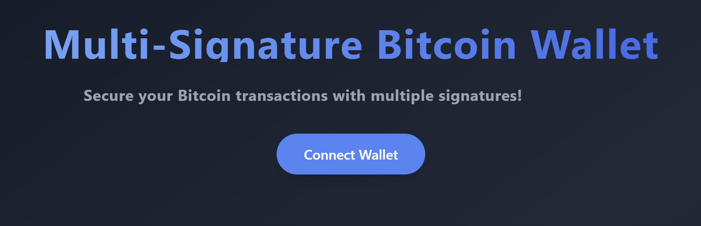
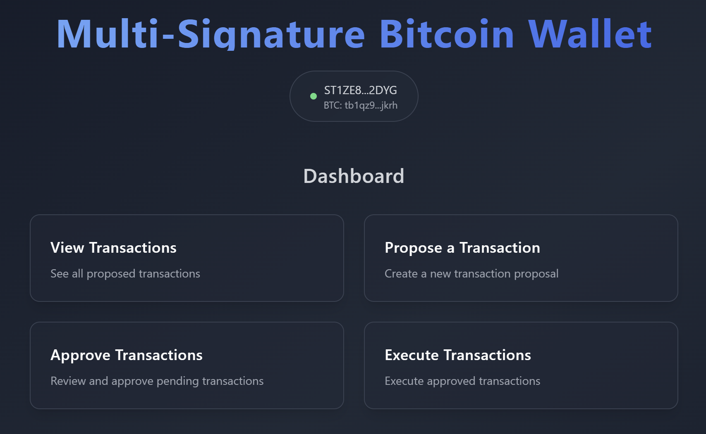
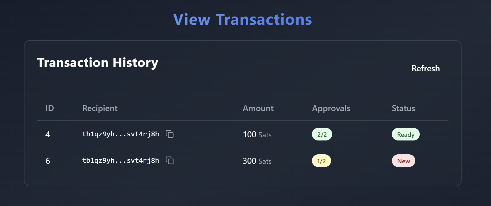
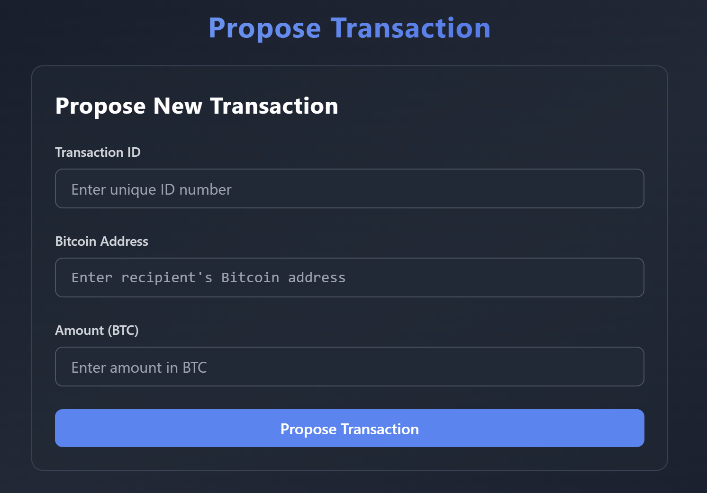
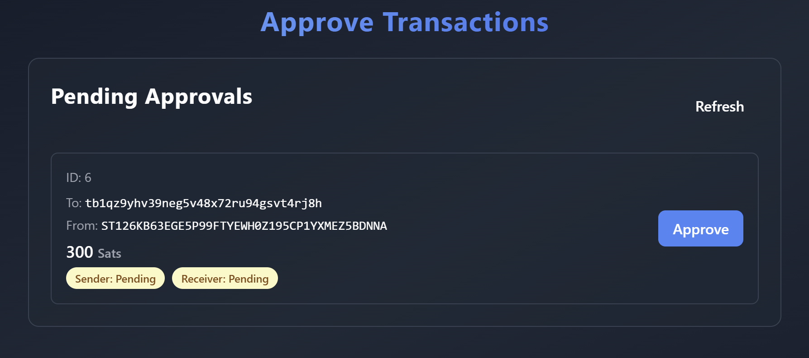
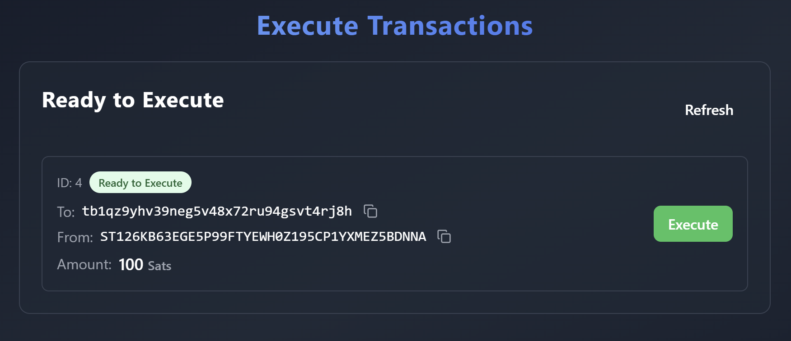

# Multi-Signature Bitcoin Wallet (Stacks Smart Contract + React Frontend)


## 🌟 Project Overview

This project is a **Multi-Signature Bitcoin Wallet** built using:
- **Stacks Smart Contracts** (Written in Clarity)
- **React with TypeScript** (For the frontend)
- **Stacks.js** (For blockchain interactions)
- **Next.js** (For SSR and optimized performance)

### ✨ Features:
- 📌 **Connect / Disconnect Stacks Wallet**
- 🔐 **Propose Transactions** (Multi-signature approval required)
- ✅ **Approve Transactions**
- 🚀 **Execute Transactions**
- 📡 **Retrieve Past Transactions**

## 🏗 Project Structure

```plaintext
multi-sig-wallet/
│── smart_contract/          # Clarity smart contract
│   ├── contracts/           # Contains the main contract
│   ├── tests/               # Clarity tests
│   ├── Clarinet.toml        # Clarinet config file
│
│── frontend/                # TypeScript + Next.js frontend
│   ├── src/
│   │   ├── components/      # Reusable UI components (Wallet, TransactionList, etc.)
│   │   ├── utils/           # Blockchain interaction logic
│   │   ├── pages/           # Next.js page structure
│   │── package.json         # Dependencies
│   │── tsconfig.json        # TypeScript config
│
│── README.md                # Documentation
│── .gitignore               # Ignore unnecessary files
```

## 🚀 Installation & Setup
### 1️⃣ Clone the Repository
```bash
git clone https://github.com/freestyledjokic/multi-sig-wallet.git
cd multi-sig-wallet
cd frontend
```
### 2️⃣ Install Dependencies
```bash
npm install
```
### 3️⃣ Set Up Variables in stacks.ts
```bash
const contractAddress = "YOUR_STX_WALLET_NAME";
```
### 4️⃣ Run the project
```bash
npm run dev
```
Then open http://localhost:3000 in your browser.


## 🖼 Project Screenshots

Here are some screenshots showcasing the multi-sig wallet's features and functionality.

### 1️⃣ **Homepage (Connect Wallet)**
_This is the initial screen where users can connect their Stacks wallet._



---

### 2️⃣ **Dashboard (Once Connected)**
_After connecting, users can see their dashboard with wallet details and available actions._



---

### 3️⃣ **View Transactions**
_Users can browse the list of proposed, approved, and executed transactions._



---

### 4️⃣ **Propose a Transaction**
_A user can propose a new transaction by entering the recipient and amount._



---

### 5️⃣ **Approve a Transaction**
_Signers can approve a pending transaction._



---

### 6️⃣ **Execute a Transaction**
_Once enough approvals are gathered, a transaction can be executed._



---

